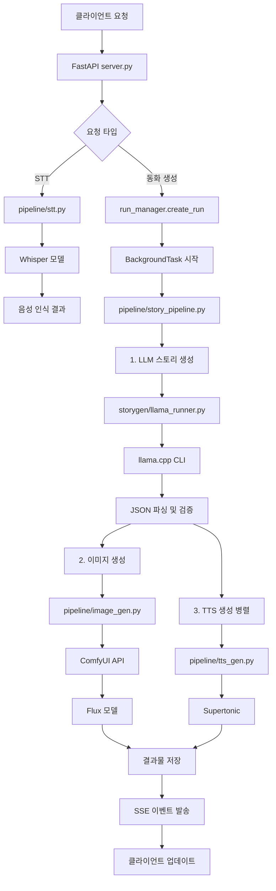
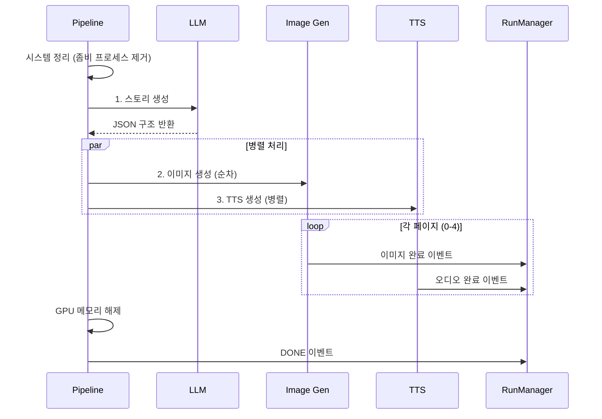
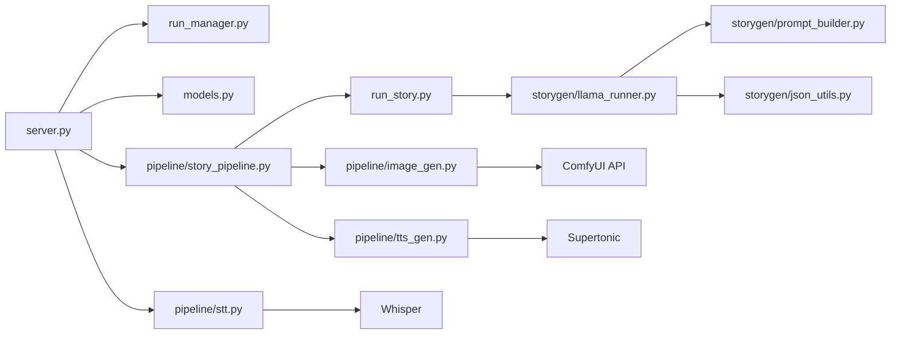

# 백엔드 아키텍처 상세 Review

## 📐 시스템 아키텍처 개요

FastAPI 기반의 비동기 스토리 생성 백엔드 시스템으로, LLM, 이미지 생성(ComfyUI), TTS를 통합하여 동화책을 생성합니다.

### 기술 스택
- **Framework**: FastAPI (비동기 웹 프레임워크)
- **LLM**: llama.cpp (GGUF 모델)
- **이미지 생성**: ComfyUI (Flux 모델)
- **음성 생성**: Supertonic (한국어 TTS)
- **STT**: OpenAI Whisper (음성 인식)

---

## 🏗️ 모듈 구조

```
make_story/
├── server.py                  # FastAPI 메인 서버
├── models.py                  # Pydantic 데이터 모델
├── run_manager.py             # Run 상태 관리 및 SSE
├── run_story.py               # 스토리 생성 엔트리포인트
├── pipeline/                  # 생성 파이프라인
│   ├── story_pipeline.py      # 메인 파이프라인 오케스트레이터
│   ├── image_gen.py           # ComfyUI 이미지 생성
│   ├── tts_gen.py             # TTS 음성 생성
│   └── stt.py                 # STT 음성 인식
├── storygen/                  # LLM 스토리 생성
│   ├── llama_runner.py        # LLM 실행기
│   ├── prompt_builder.py      # 프롬프트 빌더
│   ├── json_utils.py          # JSON 파싱
│   └── validators.py          # 검증 로직
└── outputs/                   # 생성된 결과물 저장
    └── {run_id}/
        ├── cover.png
        ├── panel_1.png ~ panel_4.png
        └── page_0.wav ~ page_4.wav
```

---

## 🔄 전체 처리 흐름



---

## 📦 핵심 모듈 상세

### 1. server.py - FastAPI 메인 서버

**역할**: HTTP 엔드포인트 제공 및 요청 라우팅

#### 주요 엔드포인트

| 엔드포인트 | 메서드 | 기능 | 비동기 |
|----------|------|------|--------|
| `/` | GET | 정적 파일 서빙 | ❌ |
| `/api/stt/field` | POST | 필드별 STT 처리 | ✅ |
| `/api/runs` | POST | 스토리 생성 시작 | ✅ |
| `/api/runs/{run_id}` | GET | Run 상태 조회 | ✅ |
| `/api/runs/{run_id}/events` | GET | SSE 이벤트 스트림 | ✅ |
| `/api/runs/{run_id}/images/{filename}` | GET | 이미지 다운로드 | ✅ |
| `/api/runs/{run_id}/audio/{filename}` | GET | 오디오 다운로드 | ✅ |

#### 세션 관리

```python
# 글로벌 세션 락: 동시에 하나의 생성만 허용
active_session_lock = {
    "run_id": None,
    "in_progress": False
}
```

**동작 방식**:
1. `/api/runs` 요청 시 락 확인
2. 진행 중이면 `503 Service Unavailable` 반환
3. 락 획득 후 백그라운드 태스크 시작
4. 파이프라인 완료/실패 시 락 해제

#### GPU 메모리 정리

```python
# 생성 시작 전 GPU 메모리 클린업
gc.collect()
if torch.cuda.is_available():
    torch.cuda.empty_cache()
    torch.cuda.synchronize()
```

---

### 2. run_manager.py - 상태 관리자

**역할**: Run 생애주기 관리 및 SSE 이벤트 발송

#### RunState 클래스

```python
class RunState:
    run_id: str                    # 타임스탬프 기반 고유 ID
    status: Status                 # QUEUED/RUNNING/DONE/FAILED
    stage: Stage                   # LLM/COVER/PANEL_1~4/TTS
    ready_max_page: int            # 준비된 최대 페이지 (-1~4)
    ready_max_audio_page: int      # 오디오 준비된 최대 페이지
    pages: list[PageInfo]          # 5개 페이지 정보
    error: Optional[str]           # 에러 메시지
```

#### RunManager 클래스

**주요 메서드**:
- `create_run()`: 새 run 생성 및 디렉토리 생성
- `get_run()`: Run 상태 조회
- `emit_event()`: SSE 이벤트 발송 (비동기 큐를 통해)
- `get_events()`: SSE 이벤트 스트림 생성기
- `_cleanup_old_outputs()`: 최대 100개 초과 시 오래된 결과 삭제

#### SSE 이벤트 메커니즘

```python
# 이벤트 큐: run_id별 독립적인 큐
self.event_queues: dict[str, asyncio.Queue] = defaultdict(asyncio.Queue)

# 이벤트 발송
async def emit_event(self, run_id: str, event_data: dict):
    await self.event_queues[run_id].put(event_data)

# 이벤트 스트리밍 (30초마다 keepalive)
async def get_events(self, run_id: str):
    queue = self.event_queues[run_id]
    while True:
        try:
            event = await asyncio.wait_for(queue.get(), timeout=30.0)
            yield event
        except asyncio.TimeoutError:
            yield {"keepalive": True}  # 연결 유지
```

---

### 3. pipeline/story_pipeline.py - 메인 오케스트레이터

**역할**: 전체 생성 파이프라인 조율

#### 파이프라인 단계



#### 주요 로직

##### 1️⃣ 시스템 정리 (시작 전)
```python
# 좀비 LLM 프로세스 제거
subprocess.run(["taskkill", "/F", "/IM", "llama-cli.exe"], 
               capture_output=True, check=False)

# ComfyUI GPU 메모리 해제
await loop.run_in_executor(None, lambda: ComfyUIClient().free_memory())
```

##### 2️⃣ LLM 스토리 생성
```python
# 블로킹 방지를 위해 executor에서 실행
story_obj = await loop.run_in_executor(
    None,
    generate_story,
    run_state.era,
    run_state.place,
    run_state.characters,
    run_state.topic
)

# 반환 구조:
# {
#   "panels": [
#     {"panel": 0, "subject": "제목", "prompt": "이미지 프롬프트"},
#     {"panel": 1, "summary": "내용", "prompt": "이미지 프롬프트"},
#     ...
#   ]
# }
```

##### 3️⃣ 이미지 + TTS 병렬 생성
```python
# TTS 태스크를 먼저 백그라운드에서 시작
audio_coroutines = [
    generate_single_audio(0, cover_title),
    generate_single_audio(1, panel_1_summary),
    ...
]
audio_gathering_task = asyncio.gather(*audio_coroutines)

# 이미지는 순차 생성 (GPU 메모리 제약)
await generate_single_image(0, cover_prompt, seed)
await generate_single_image(1, panel_1_prompt, seed)
...

# 모든 오디오 완료 대기
await audio_gathering_task
```

---

### 4. pipeline/image_gen.py - ComfyUI 통합

**역할**: ComfyUI API를 통한 이미지 생성

#### ComfyUIClient 클래스

**주요 메서드**:

| 메서드 | 기능 |
|--------|------|
| `is_running()` | ComfyUI 서버 상태 확인 |
| `queue_prompt()` | 워크플로우 큐에 추가 |
| `wait_for_completion()` | 완료까지 대기 (폴링, 최대 300초) |
| `download_image()` | 생성된 이미지 다운로드 |
| `free_memory()` | GPU 메모리 해제 |

#### 워크플로우 수정 로직

```python
def modify_workflow_for_panel(workflow, positive_prompt, seed):
    # UI 형식 → API 형식 변환
    api_workflow = {}
    
    for node in workflow["nodes"]:
        if node["type"] == "CLIPTextEncode":
            # 포지티브 프롬프트에 스타일 추가
            api_node["inputs"]["text"] = 
                "watercolor painting, children's book illustration, " + positive_prompt
                
            # 네거티브 프롬프트 강화 (텍스트 방지)
            negative = "text, letters, words, writing, typography, ..."
            
        elif node["type"] == "KSampler":
            api_node["inputs"]["seed"] = seed
            api_node["inputs"]["steps"] = 4  # 속도 최적화
            
    return api_workflow
```

#### 이미지 생성 플로우

```python
workflow = load_workflow_template("make_panel.json")
workflow = modify_workflow_for_panel(workflow, prompt, seed)
prompt_id = client.queue_prompt(workflow)
history = client.wait_for_completion(prompt_id, timeout=300)

# 이미지 추출 및 저장
image_data = client.download_image(filename, subfolder)
output_path.write_bytes(image_data)
```

---

### 5. pipeline/tts_gen.py - TTS 생성

**역할**: Supertonic을 사용한 한국어 TTS

```python
def generate_tts(text, output_path, voice="M2", lang="ko", speed=1.05):
    # Supertonic 모델 로드 (ONNX)
    text_to_speech = load_text_to_speech(onnx_dir, use_gpu=False)
    style = load_voice_style(voice_style_path)
    
    # 음성 생성
    wav, duration = text_to_speech(text, lang, style, 
                                     total_step=10, speed=speed)
    
    # WAV 파일 저장
    sf.write(output_path, wav[0, :trim_len], sample_rate)
```

**특징**:
- CPU 모드 사용 (`use_gpu=False`)
- 이미지 생성과 병렬 실행 가능
- 음성: M1-M5 (남성), F1-F5 (여성)

---

### 6. pipeline/stt.py - STT 처리

**역할**: Whisper를 사용한 음성 인식

#### 처리 플로우

```python
async def process_field_stt(audio_data, field_type, language="ko"):
    # 1. 임시 파일 저장
    tmp_path.write_bytes(audio_data)
    
    # 2. ffmpeg로 WAV 변환 (16kHz, mono)
    subprocess.run([
        ffmpeg, '-i', tmp_path,
        '-ar', '16000', '-ac', '1', wav_path
    ])
    
    # 3. Whisper 모델 로드 (CPU 모드)
    model = whisper.load_model("medium", device="cpu")
    
    # 4. 음성 인식
    result = model.transcribe(audio_array, language="ko", fp16=False)
    stt_text = result["text"].strip()
    
    # 5. Confidence 계산
    segments = result.get("segments", [])
    confidence = 1.0 - avg(seg["no_speech_prob"])
    
    # 6. 필드별 파싱
    parsed_value = FieldParser.parse_{field_type}(stt_text)
    
    # 7. GPU 메모리 즉시 해제
    del model
    torch.cuda.empty_cache()
    gc.collect()
    
    return stt_text, parsed_value, confidence
```

**CPU 모드 사용 이유**:
- ComfyUI/LLM과 GPU 메모리 충돌 방지
- STT는 실시간성이 중요하지 않음

---

### 7. storygen/ - LLM 스토리 생성

#### llama_runner.py - LLM 실행

**동작 모드**:
1. **CLI 모드** (기본): `llama-cli.exe` 직접 실행
2. **Server 모드** (선택): `llama-server` API 호출

```python
def run_llama_stream(prompt):
    # Server 모드 시도
    if USE_SERVER_MODE:
        try:
            return call_llama_server(prompt, ...)
        except:
            # Server 실패 시 CLI로 폴백
            pass
    
    # CLI 모드
    return _run_llama_cli(prompt)
```

#### CLI 모드 로직

```python
def _run_llama_cli(prompt):
    # 1. 프롬프트 파일 저장
    PROMPT_PATH.write_text(prompt, encoding="utf-8")
    
    # 2. llama-cli 실행
    cmd = [
        LLAMA_CLI, "-m", GGUF_MODEL,
        "-f", PROMPT_PATH,
        "--temp", "0.7", "--top-p", "0.9",
        "-n", "2048", "-ngl", "99",  # GPU 레이어
        "--grammar-file", GRAMMAR_FILE  # JSON 강제
    ]
    
    # 3. 스트리밍 출력 파싱 (JSON 완성 감지)
    depth = 0
    while True:
        ch = process.stdout.read(1)
        if ch == "{": depth += 1
        elif ch == "}": depth -= 1
        
        if depth == 0:  # JSON 완성
            process.stdin.write("\n/exit\n")
            break
    
    return output
```

#### Grammar 파일 (story_spec.gbnf)

```gbnf
root ::= "{" ws "\"panels\":" ws panels ws "}"
panels ::= "[" panel ("," panel)* "]"
panel ::= "{" ... "}"
```

**역할**: LLM 출력을 강제로 JSON 형식으로 제한

---

## 🗂️ 데이터 모델 (models.py)

### Enum 타입

```python
class FieldType(str, Enum):
    ERA = "era"
    PLACE = "place"
    CHARACTERS = "characters"
    TOPIC = "topic"

class Status(str, Enum):
    QUEUED = "QUEUED"
    RUNNING = "RUNNING"
    DONE = "DONE"
    FAILED = "FAILED"

class Stage(str, Enum):
    LLM = "LLM"
    COVER = "COVER"
    PANEL_1 = "PANEL_1"
    PANEL_2 = "PANEL_2"
    PANEL_3 = "PANEL_3"
    PANEL_4 = "PANEL_4"
    TTS = "TTS"
```

### 요청/응답 모델

```python
class CreateRunRequest(BaseModel):
    era_ko: str
    place_ko: str
    characters_ko: str
    topic_ko: str
    tts_enabled: bool = True

class PageInfo(BaseModel):
    page: int = Field(ge=0, le=4)
    title: str = ""
    summary: str = ""
    image_url: str = ""
    audio_url: str = ""

class RunStateResponse(BaseModel):
    status: Status
    stage: Stage
    ready_max_page: int = Field(ge=-1, le=4)
    ready_max_audio_page: int = Field(ge=-1, le=4)
    pages: list[PageInfo]  # 항상 5개
    error: Optional[str] = None
```

---

## ⚡ 성능 최적화

### 1. 비동기 처리

```python
# 블로킹 작업을 executor에서 실행
await loop.run_in_executor(None, blocking_function, args)
```

**적용 대상**:
- LLM 생성 (`generate_story`)
- 이미지 생성 (`generate_panel_image`)
- TTS 생성 (`generate_page_audio`)

### 2. 병렬 처리

```python
# 이미지(GPU)와 TTS(CPU)를 동시 실행
audio_task = asyncio.gather(*audio_coroutines)  # 백그라운드 시작

# 이미지는 순차 (GPU 메모리 제약)
await generate_image(0)
await generate_image(1)
...

await audio_task  # 오디오 완료 대기
```

**효과**: 전체 생성 시간 ~30% 단축

### 3. GPU 메모리 관리

```python
# 1. 시작 전 정리
ComfyUIClient().free_memory()
torch.cuda.empty_cache()

# 2. 이미지 생성 후 즉시 해제
await generate_all_images()
ComfyUIClient().free_memory()

# 3. STT 후 즉시 해제
del whisper_model
torch.cuda.empty_cache()
gc.collect()
```

### 4. 이미지 생성 최적화

```python
# KSampler 단계 최적화
"steps": 4  # 기본 20 → 4로 감소 (품질 vs 속도 트레이드오프)
```

---

## 🛡️ 에러 처리 및 복원력

### 파이프라인 에러 처리

```python
try:
    await run_story_pipeline(run_id, run_manager)
except Exception as e:
    run_state.status = Status.FAILED
    run_state.error = str(e)
    await run_manager.emit_event(run_id, {
        "status": "FAILED",
        "error": str(e)
    })
finally:
    # 항상 락 해제
    active_session_lock["in_progress"] = False
```

### 시스템 정리 (좀비 프로세스 제거)

```python
# LLM CLI가 종료되지 않고 남아있을 수 있음
subprocess.run(["taskkill", "/F", "/IM", "llama-cli.exe"], 
               capture_output=True, check=False)
```

### 타임아웃

```python
# ComfyUI 이미지 생성: 300초
history = client.wait_for_completion(prompt_id, timeout=300)

# SSE keepalive: 30초
event = await asyncio.wait_for(queue.get(), timeout=30.0)
```

---

## 📁 파일 시스템 구조

### 출력 디렉토리

```
outputs/
└── 20260130_123456_a1b2c3/        # run_id
    ├── cover.png                   # 표지 이미지
    ├── panel_1.png ~ panel_4.png   # 패널 이미지
    └── page_0.wav ~ page_4.wav     # 오디오 파일
```

### 정리 정책

- **최대 보관**: 100개 run
- **정리 방식**: 가장 오래된 것부터 삭제
- **트리거**: 새 run 생성 시

---

## 🔍 디버깅 및 로깅

### 타이밍 로그

```python
print(f"[TIMING] Starting LLM generation...")
llm_start = time.time()
# ... 작업 ...
print(f"[TIMING] LLM completed in {time.time() - llm_start:.2f}s")
```

**측정 대상**:
- LLM 생성 시간
- 각 이미지 생성 시간
- 각 오디오 생성 시간

### GPU 메모리 로그

```python
print(f"[GPU CLEANUP] Cleaning GPU memory before starting...")
# ... 정리 ...
print("[GPU CLEANUP] GPU memory freed, ready for generation")
```

---

## 🔄 의존성 흐름



---

## 🚀 실행 흐름 예시

### 전체 타임라인 (실제 측정)

```
00:00  POST /api/runs (run_id 반환, 즉시)
00:01  [GPU CLEANUP] 시스템 정리
00:02  [LLM] 스토리 생성 시작
00:32  [LLM] 완료 (30초)
00:32  [COVER] 표지 이미지 시작
00:32  [TTS] 모든 오디오 백그라운드 시작
00:42  [COVER] 완료 (10초) → SSE 이벤트 → 프론트 표시
00:42  [PANEL_1] 시작
00:52  [PANEL_1] 완료 → SSE 이벤트
00:52  [PANEL_2] 시작
01:02  [PANEL_2] 완료 → SSE 이벤트
01:02  [PANEL_3] 시작
01:12  [PANEL_3] 완료 → SSE 이벤트
01:12  [PANEL_4] 시작
01:22  [PANEL_4] 완료 → SSE 이벤트
01:22  [TTS] 모든 오디오 완료 대기
01:37  [TTS] 완료 (총 15초, 병렬 실행)
01:37  [DONE] 전체 완료 → SSE 이벤트
```

**총 소요 시간**: ~97초 (1분 37초)

---

## 📊 리소스 사용 패턴

| 단계 | GPU | CPU | 시간 |
|------|-----|-----|------|
| LLM | ✅ | ✅ | 30s |
| 이미지 생성 (x5) | ✅ | ❌ | 50s |
| TTS (x5, 병렬) | ❌ | ✅ | 15s |

**최적화 포인트**:
- LLM과 이미지 생성은 GPU 공유 → 순차 실행
- TTS는 CPU만 사용 → 이미지와 병렬 실행 가능

---

## 🔧 개선 가능 영역

### 1. 이미지 생성 병렬화
현재는 VRAM 제약으로 순차 실행하지만, 더 큰 GPU에서는 병렬 가능

### 2. LLM 캐싱
동일한 입력에 대한 결과 캐싱으로 재생성 속도 향상

### 3. 에러 응답 표준화
외부 API 제공 시 구조화된 에러 코드 필요

### 4. 모니터링 강화
- Prometheus 메트릭 추가
- 생성 시간 히스토그램
- GPU 메모리 사용량 추적

### 5. 스케일링
현재는 단일 세션만 지원 → 큐 시스템 도입 검토
