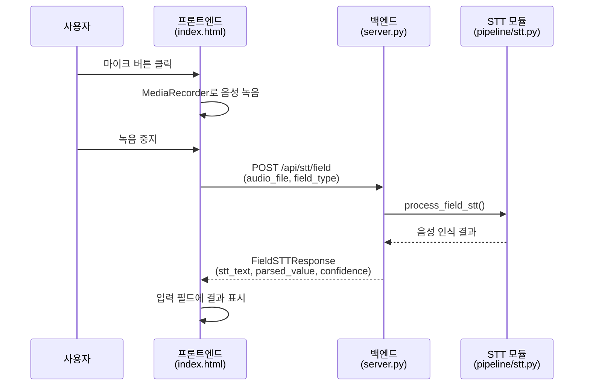
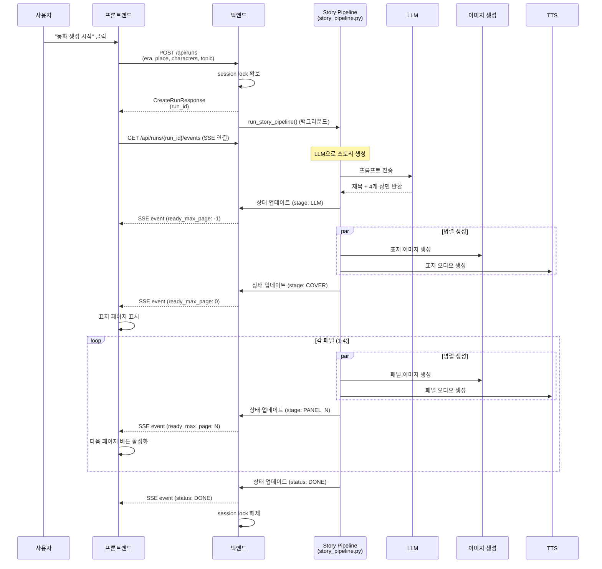

# 프론트엔드-백엔드 통신 구조 Review

## 📋 시스템 개요

AI 동화책 생성 시스템은 FastAPI 백엔드와 바닐라 JavaScript 프론트엔드로 구성된 웹 애플리케이션입니다.

### 기술 스택
- **Backend**: FastAPI (Python)
- **Frontend**: HTML + Vanilla JavaScript
- **통신 프로토콜**: REST API + Server-Sent Events (SSE)

---

## 🔄 통신 플로우

### 1. 음성 입력 (STT) 플로우



**API 엔드포인트**: `POST /api/stt/field`

**요청 형식** (multipart/form-data):
- `audio_file`: 녹음된 오디오 파일 (WebM/MP4/WAV)
- `field_type`: 필드 타입 (`era`, `place`, `characters`, `topic`)
- `language`: 언어 코드 (기본값: `ko-KR`)

**응답 형식** (JSON):
```json
{
  "stt_text": "원시시대",
  "parsed_value": "원시시대",
  "confidence": 0.95
}
```

**프론트엔드 구현**:
- `startSTT(fieldType)`: 녹음 시작
- `sendSTT(audioBlob, fieldType, mimeType)`: 서버로 전송

---

### 2. 동화 생성 플로우



#### 2.1. 동화 생성 시작

**API 엔드포인트**: `POST /api/runs`

**요청 형식** (JSON):
```json
{
  "era_ko": "현대",
  "place_ko": "숲",
  "characters_ko": "토끼, 여우",
  "topic_ko": "우정",
  "tts_enabled": true
}
```

**응답 형식** (JSON):
```json
{
  "run_id": "run_1234567890abcdef"
}
```

**백엔드 동작**:
1. 세션 락 확인 (한 번에 하나의 생성만 허용)
2. `run_manager.create_run()`으로 run 생성
3. GPU 메모리 정리
4. 백그라운드 태스크로 `run_story_pipeline()` 실행
5. 즉시 `run_id` 반환

#### 2.2. 진행 상황 모니터링 (SSE)

**API 엔드포인트**: `GET /api/runs/{run_id}/events`

**응답 형식** (Server-Sent Events):
```
event: update
data: {"status":"RUNNING","stage":"LLM","ready_max_page":-1,"ready_max_audio_page":-1}

event: update
data: {"status":"RUNNING","stage":"COVER","ready_max_page":0,"ready_max_audio_page":0}

event: update
data: {"status":"RUNNING","stage":"PANEL_1","ready_max_page":1,"ready_max_audio_page":1}

...

event: update
data: {"status":"DONE","stage":"PANEL_4","ready_max_page":4,"ready_max_audio_page":4}
```

**프론트엔드 구현**:
- `monitorProgress(runId)`: EventSource로 SSE 연결
- `updatePageDisplay(data)`: 페이지별 준비 상태 확인
- `displayPage(pageNum)`: 페이지 콘텐츠 표시

#### 2.3. 상태 조회

**API 엔드포인트**: `GET /api/runs/{run_id}`

**응답 형식** (JSON):
```json
{
  "status": "RUNNING",
  "stage": "PANEL_2",
  "ready_max_page": 2,
  "ready_max_audio_page": 2,
  "pages": [
    {
      "page": 0,
      "title": "토끼와 여우의 우정",
      "summary": "",
      "image_url": "/api/runs/run_xxx/images/cover.png",
      "audio_url": "/api/runs/run_xxx/audio/cover.wav"
    },
    {
      "page": 1,
      "title": "",
      "summary": "숲 속에서 토끼와 여우가 만났습니다...",
      "image_url": "/api/runs/run_xxx/images/panel_1.png",
      "audio_url": "/api/runs/run_xxx/audio/panel_1.wav"
    },
    ...
  ],
  "error": null
}
```

#### 2.4. 이미지/오디오 다운로드

**API 엔드포인트**:
- `GET /api/runs/{run_id}/images/{filename}`
- `GET /api/runs/{run_id}/audio/{filename}`

**응답**: 바이너리 파일 (PNG 또는 WAV)

**프론트엔드 사용**:
```javascript

<audio src="/api/runs/run_xxx/audio/cover.wav" controls>
```

---

## 🎯 주요 데이터 모델

### FieldType (Enum)
```python
ERA = "era"          # 시대
PLACE = "place"      # 배경
CHARACTERS = "characters"  # 등장인물
TOPIC = "topic"      # 주제
```

### Status (Enum)
```python
QUEUED = "QUEUED"    # 대기 중
RUNNING = "RUNNING"  # 실행 중
DONE = "DONE"        # 완료
FAILED = "FAILED"    # 실패
```

### Stage (Enum)
```python
LLM = "LLM"          # LLM 스토리 생성 중
COVER = "COVER"      # 표지 생성 중
PANEL_1 = "PANEL_1"  # 1번 패널 생성 중
PANEL_2 = "PANEL_2"  # 2번 패널 생성 중
PANEL_3 = "PANEL_3"  # 3번 패널 생성 중
PANEL_4 = "PANEL_4"  # 4번 패널 생성 중
TTS = "TTS"          # TTS 생성 중
```

---

## 🔐 보안 및 검증

### 파일명 검증
```python
# 디렉토리 순회 공격 방지
if ".." in filename or "/" in filename or "\\" in filename:
    raise HTTPException(status_code=400, detail="Invalid filename")
```

### 세션 락
```python
# 동시에 하나의 생성만 허용
active_session_lock = {"run_id": None, "in_progress": False}
```

---

## 🎨 프론트엔드 화면 구조

### 화면 흐름
1. **입력 화면 (1/4~4/4)**
   - 시대 입력 (`screen-era`)
   - 배경 입력 (`screen-place`)
   - 등장인물 입력 (`screen-characters`)
   - 주제 입력 (`screen-topic`)

2. **스토리 화면 (0~4)**
   - 표지 (`screen-story-0`)
   - 1번 패널 (`screen-story-1`)
   - 2번 패널 (`screen-story-2`)
   - 3번 패널 (`screen-story-3`)
   - 4번 패널 (`screen-story-4`)

### 상태 관리
```javascript
let currentScreenIndex = 0;           // 현재 입력 화면 인덱스
let currentStoryPage = 0;             // 현재 스토리 페이지
let currentRunId = null;              // 현재 run ID
let eventSource = null;               // SSE 연결
let pageReadyStatus = [false, false, false, false, false];  // 페이지별 준비 상태
```

### 점진적 렌더링
- 각 페이지는 이미지와 오디오가 모두 준비되면 표시됨
- "다음 페이지" 버튼은 다음 페이지가 준비되면 활성화됨
- 로딩 스피너 → 실제 콘텐츠로 전환

---

## 🚀 성능 최적화

### GPU 메모리 관리
```python
# 생성 시작 전 GPU 메모리 정리
gc.collect()
torch.cuda.empty_cache()
torch.cuda.synchronize()
```

### 병렬 처리
- 이미지 생성과 오디오 생성을 병렬로 실행
- 각 패널은 순차적으로 생성되지만 내부적으로 병렬 처리

### 백그라운드 태스크
- FastAPI `BackgroundTasks`로 스토리 생성을 백그라운드에서 실행
- 클라이언트는 즉시 `run_id`를 받고 SSE로 진행 상황 모니터링

---

## 🔍 에러 처리

### 백엔드
- **422 Validation Error**: 요청 데이터 검증 실패 시 상세 에러 정보 반환
- **503 Service Unavailable**: 다른 생성이 진행 중일 때
- **404 Not Found**: run_id나 파일을 찾을 수 없을 때
- **500 Internal Server Error**: STT 처리 실패 등

### 프론트엔드
- STT 실패 시 사용자에게 알림
- 생성 실패 시 초기 화면으로 리셋
- EventSource 연결 종료 처리

---

## 📊 통신 프로토콜 요약

| 엔드포인트 | 메서드 | 목적 | 요청 형식 | 응답 형식 |
|----------|------|------|---------|---------|
| `/api/stt/field` | POST | 음성 → 텍스트 변환 | multipart/form-data | JSON |
| `/api/runs` | POST | 동화 생성 시작 | JSON | JSON |
| `/api/runs/{run_id}` | GET | 상태 조회 | - | JSON |
| `/api/runs/{run_id}/events` | GET | 실시간 진행 상황 | - | SSE |
| `/api/runs/{run_id}/images/{filename}` | GET | 이미지 다운로드 | - | PNG |
| `/api/runs/{run_id}/audio/{filename}` | GET | 오디오 다운로드 | - | WAV |

---

## 🛠️ CORS 설정

```python
app.add_middleware(
    CORSMiddleware,
    allow_origins=["*"],
    allow_credentials=True,
    allow_methods=["*"],
    allow_headers=["*"],
)
```

**현재 설정**: 모든 origin 허용 (개발 환경)  
**프로덕션**: 특정 도메인만 허용하도록 변경 필요

---

## 📝 주요 특징

1. **RESTful API + SSE 하이브리드**: 동기/비동기 통신 결합
2. **점진적 렌더링**: 페이지별로 준비되는 대로 표시
3. **세션 격리**: 한 번에 하나의 사용자만 생성 가능
4. **타입 안전성**: Pydantic 모델로 API 계약 명확히 정의
5. **에러 복원력**: 실패 시 자동 리셋 및 세션 락 해제
